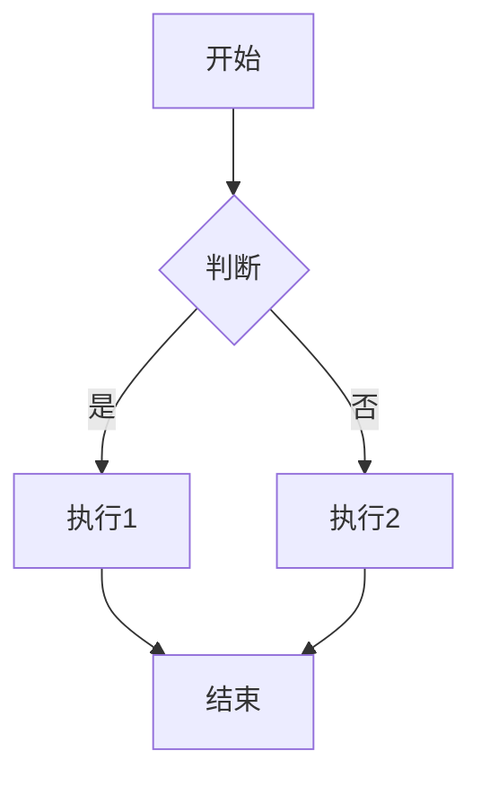

# 完整 Markdown 渲染器实现计划

## 摘要

为 AIChat 项目升级 Markdown 渲染能力，在现有 `react-markdown + remark-gfm + rehype-highlight` 基础上，新增：
1. **自定义代码块组件**：左上角显示语言标签、右上角带图标的复制按钮、HTML 专属预览按钮
2. **Mermaid 流程图渲染**：通过 `mermaid` 库客户端渲染为 SVG
3. **数学/化学/物理公式渲染**：通过 `remark-math` 解析语法 + MathJax 3（CDN）客户端渲染，启用 AMS + mhchem + physics 宏包
4. **代码高亮主题自动切换**：暗色模式使用 github-dark，亮色模式使用 github-light 配色

---

## 当前状态分析

| 能力 | 状态 | 说明 |
|---|---|---|
| 基础 Markdown | 有 | `react-markdown` |
| GFM（表格等） | 有 | `remark-gfm` |
| 代码高亮 | 有（基础） | `rehype-highlight`，无自定义 UI，无主题 CSS |
| 自定义代码块 UI | 无 | 未使用 `components` 属性 |
| Mermaid 图表 | 无 | 无依赖与处理逻辑 |
| 数学公式 | 无 | prompt 中已出现 LaTeX，但前端未渲染 |

**关键文件**：
- [src/render/MarkdownRenderer.tsx](file:///c:/Users/赵晨旭/Desktop/AIChat/src/render/MarkdownRenderer.tsx) — 主渲染器，需重构
- [src/components/chat/MessageBubble.tsx](file:///c:/Users/赵晨旭/Desktop/AIChat/src/components/chat/MessageBubble.tsx) — 消息气泡，调用 MarkdownRenderer
- [src/index.css](file:///c:/Users/赵晨旭/Desktop/AIChat/src/index.css) — 已有 `.preview-modal`、`.code-preview-frame` 等样式基础
- [src/render/index.ts](file:///c:/Users/赵晨旭/Desktop/AIChat/src/render/index.ts) — 模块导出入口

**主题系统**：通过 `document.documentElement.setAttribute('data-theme', 'dark'|'light')` 切换，已有完整的 CSS 变量体系。

---

## 拟变更文件

### 1. package.json
**变更内容**：新增 3 个运行时依赖
```json
{
  "mermaid": "^11.0.0",
  "remark-math": "^6.0.0",
  "highlight.js": "^11.10.0"
}
```
- `mermaid`：Mermaid 语法客户端渲染为 SVG
- `remark-math`：识别 `$...$` 和 `$$...$$` 公式语法
- `highlight.js`：`rehype-highlight` 的 peer dependency，同时提供 github-dark/github-light 主题 CSS

---

### 2. src/render/MarkdownRenderer.tsx（重构）
**当前问题**：仅传入 `remarkPlugins`/`rehypePlugins`，未自定义 `components`，所有节点均使用默认渲染。

**变更内容**：
- 导入 `remarkMath` 与 3 个新增子组件（`CodeBlock`, `MermaidBlock`, `MathBlock`）
- 配置 `remarkPlugins={[remarkGfm, remarkMath]}`
- 配置 `rehypePlugins={[rehypeHighlight]}`（保留）
- 定义 `components` 映射：
  - `code` → `CodeBlock`
  - `math` → `MathBlock`（display 模式）
  - `inlineMath` → `MathBlock`（inline 模式）

**为什么**：`react-markdown` 通过 `components` 属性开放自定义节点渲染，`remark-math` 产生的 `math`/`inlineMath` 节点也需要对应组件处理。

---

### 3. src/render/CodeBlock.tsx（新建）
**职责**：自定义代码块渲染，提供语言标签、复制、HTML 预览功能。

**Props 设计**：
```ts
interface CodeBlockProps {
  inline?: boolean;
  className?: string;
  children: React.ReactNode;
}
```

**核心逻辑**：
1. 从 `className` 正则提取 `language-xxx`，得到语言标识
2. `inline === true` 时直接返回 `<code className={className}>`
3. `inline === false` 时：
   - 包裹在 `.code-block-wrapper` 中
   - 顶部 `.code-block-header`：左侧语言标签（大写），右侧操作按钮区
   - 操作按钮：
     - **复制按钮**：使用 `lucide-react` 的 `Copy` / `Check` 图标，点击调用 `navigator.clipboard.writeText(code)`，成功后将图标切换为 `Check`，1.5 秒后恢复
     - **预览按钮**：仅在 `language === 'html'` 时显示，使用 `Eye` 图标，点击唤起 HTML 预览浮层
   - 代码内容放在 `.code-block-body > pre > code` 中，确保 `rehype-highlight` 的 class 正常生效

**HTML 预览实现**：
- 组件内部维护 `showPreview` 状态
- 预览层使用 `position: fixed` overlay（复用现有 `.modal-overlay` 样式）
- 内容区使用 `.preview-modal` + `.code-preview-frame`（iframe，srcdoc 注入 HTML 代码）
- 关闭按钮使用 `X` 图标，位于弹窗右上角

**为什么放在 CodeBlock 内部**：预览是代码块的直接附属功能，状态耦合度高，无需独立全局弹窗组件。

---

### 4. src/render/MermaidBlock.tsx（新建）
**职责**：将 Mermaid 语法文本渲染为 SVG 图表。

**Props 设计**：
```ts
interface MermaidBlockProps {
  code: string;
}
```

**核心逻辑**：
1. 使用 `useRef<HTMLDivElement>` 作为容器
2. `useEffect` 中：
   - 调用 `mermaid.initialize({ theme, startOnLoad: false })`，`theme` 根据当前 `data-theme` 取 `'dark'` 或 `'default'`
   - 调用 `mermaid.render(generateId(), code)` 获取 SVG 字符串
   - 将 SVG 注入容器 `innerHTML`
   - 捕获错误，渲染 `.mermaid-error` 提示
3. 监听主题变化（`MutationObserver` 观察 `document.documentElement` 的 `data-theme` 属性），变化后重新初始化并渲染

**为什么不用 `mermaid.run()`**：`run()` 扫描 DOM，在 React 受控渲染场景下容易重复或遗漏；`render()` 更精确、可控。

---

### 5. src/render/MathBlock.tsx（新建）
**职责**：加载 MathJax 3 并渲染数学公式。

**Props 设计**：
```ts
interface MathBlockProps {
  value: string;
  display?: boolean;
}
```

**核心逻辑**：
1. 组件挂载时检查 `window.MathJax`：
   - 若不存在，在 `<head>` 中注入配置脚本 + CDN 脚本（`https://cdn.jsdelivr.net/npm/mathjax@3/es5/tex-mml-chtml.js`）
   - 配置对象：
     ```js
     window.MathJax = {
       tex: {
         packages: { '[+]': ['mhchem', 'physics'] },
         inlineMath: [['$', '$']],
         displayMath: [['$$', '$$']]
       },
       loader: { load: ['[tex]/mhchem', '[tex]/physics'] },
       startup: { typeset: false }
     };
     ```
2. CDN 加载完成后，调用 `window.MathJax.typesetPromise([containerRef.current])`
3. 组件更新（`value` 变化）时重新 `typesetPromise`
4. 组件卸载时调用 `window.MathJax.typesetClear([containerRef.current])`
5. 渲染结构：`display ? <div> : <span>`，ref 挂在该元素上，内部文本为 `value`

**为什么用 CDN 而非 npm 包**：MathJax 3 的 npm 包在 Vite 构建环境中配置复杂、体积大（>500KB），CDN 按需加载 + 浏览器端宏包加载是社区推荐方案。

---

### 6. src/index.css（修改）
**变更区域**：

#### 6.1 代码高亮主题
在文件最顶部添加：
```css
@import "highlight.js/styles/github-dark.css";
```
暗色模式直接继承 github-dark。

在文件底部添加亮色模式覆盖（基于 github-light 配色，覆盖核心 token）：
```css
[data-theme="light"] .hljs { background: #ffffff; color: #24292e; }
[data-theme="light"] .hljs-keyword,
[data-theme="light"] .hljs-selector-tag,
[data-theme="light"] .hljs-subst { color: #d73a49; }
[data-theme="light"] .hljs-string,
[data-theme="light"] .hljs-doctag { color: #032f62; }
[data-theme="light"] .hljs-comment { color: #6a737d; }
[data-theme="light"] .hljs-number,
[data-theme="light"] .hljs-literal { color: #005cc5; }
[data-theme="light"] .hljs-function,
[data-theme="light"] .hljs-class { color: #6f42c1; }
[data-theme="light"] .hljs-tag { color: #22863a; }
[data-theme="light"] .hljs-attr { color: #005cc5; }
[data-theme="light"] .hljs-operator,
[data-theme="light"] .hljs-punctuation { color: #24292e; }
[data-theme="light"] .hljs-variable { color: #e36209; }
/* 更多 token 按需补充 */
```

#### 6.2 代码块工具栏样式
```css
.code-block-wrapper { border: 1px solid var(--border); border-radius: var(--radius-sm); overflow: hidden; margin: 0 0 .75em; }
.code-block-header { display: flex; align-items: center; justify-content: space-between; padding: 8px 12px; background: var(--bg4); border-bottom: 1px solid var(--border); }
.code-block-lang { font-size: 12px; color: var(--text3); text-transform: uppercase; font-weight: 500; font-family: var(--font); }
.code-block-actions { display: flex; align-items: center; gap: 4px; }
.code-block-btn { width: 28px; height: 28px; display: flex; align-items: center; justify-content: center; background: none; border: none; border-radius: 6px; color: var(--text3); cursor: pointer; transition: all .15s; }
.code-block-btn:hover { background: var(--bg3); color: var(--text); }
.code-block-body { overflow-x: auto; padding: 12px 16px; background: var(--bg2); }
.code-block-body pre { margin: 0; background: transparent; }
```

#### 6.3 Mermaid 容器样式
```css
.mermaid-container { display: flex; justify-content: center; padding: 16px; background: var(--bg2); border: 1px solid var(--border); border-radius: var(--radius-sm); margin: 0 0 .75em; }
.mermaid-error { color: var(--danger); font-size: 13px; padding: 8px; }
```

#### 6.4 MathJax 颜色跟随主题
```css
mjx-container { color: var(--text) !important; }
.math-inline { display: inline; }
.math-display { display: block; overflow-x: auto; padding: 12px 0; }
```

---

### 7. src/render/index.ts（可选修改）
当前仅导出 `MarkdownRenderer`、`ThinkingBlock`、`extractThinkingBlocks`、`ThinkingPart`。
新增的子组件（`CodeBlock`、`MermaidBlock`、`MathBlock`）仅被 `MarkdownRenderer` 内部引用，**无需对外导出**，保持 `index.ts` 不变即可。

---

## 技术决策与假设

| 决策 | 选择 | 理由 |
|---|---|---|
| 公式引擎 | MathJax 3 (CDN) | 用户明确要求 MathJax + 宏包；KaTeX 不支持 mhchem/physics 等宏包的完整功能；Vite 下 npm 集成 MathJax 过于繁琐 |
| Mermaid 渲染方式 | `mermaid.render()` | React 受控场景下精确渲染，避免 `run()` 的全局扫描副作用 |
| 代码高亮策略 | 保留 `rehype-highlight` | 与现有架构兼容；仅需补充主题 CSS，无需替换为 Prism 等其他引擎 |
| 主题切换策略 | CSS 覆盖 + MutationObserver | 代码块通过 `[data-theme="light"]` 覆盖 `.hljs` 颜色；Mermaid 通过观察 `data-theme` 属性重新渲染；MathJax 颜色自动继承 `var(--text)` |
| HTML 预览 | iframe srcdoc | 沙箱隔离，避免样式/脚本污染主页面；复用现有 `.preview-modal`、`.code-preview-frame` 样式 |
| 流式输出处理 | 组件内部容错 | Mermaid 在流式过程中若语法不完整会报错，组件捕获错误并显示提示而非崩溃；MathJax 增量 typeset 不会阻塞渲染 |

---

## 验证步骤

1. 安装依赖：`npm install`
2. 类型检查：`npx tsc --noEmit`
3. 代码检查：`npm run lint`
4. 启动开发服务器：`npm run dev`
5. 在聊天中发送以下测试消息，逐一验证：

### 5.1 代码块与工具栏
````markdown
```typescript
const greeting: string = "Hello, World!";
console.log(greeting);
```
````
- 期望：左上角显示 "TYPESCRIPT"，右上角有复制按钮，点击后图标变为 Check 再恢复

### 5.2 HTML 预览
````markdown
```html
<!DOCTYPE html>
<html>
<body>
  <h1 style="color:red">预览测试</h1>
</body>
</html>
```
````
- 期望：除复制按钮外还有 Eye 预览按钮，点击后弹出 iframe 预览层，iframe 内显示红色标题

### 5.3 Mermaid 流程图
````markdown

````
- 期望：渲染为 SVG 流程图，切换暗色/亮色主题后图表颜色同步变化

### 5.4 数学公式
```markdown
行内公式：$E = mc^2$

块级公式：
$$\int_{a}^{b} f(x) \, dx = F(b) - F(a)$$
```
- 期望：行内公式与文字基线对齐，块级公式居中渲染

### 5.5 化学公式（mhchen 宏包）
```markdown
$$\ce{H2O + CO2 <=> H2CO3}$$

$$\ce{2H2 + O2 ->[燃烧] 2H2O}$$
```
- 期望：正确渲染化学键、反应箭头、反应条件（燃烧）

### 5.6 物理公式（physics 宏包）
```markdown
$$\ket{\psi} = \alpha\ket{0} + \beta\ket{1}$$

$$\nabla \cdot \mathbf{E} = \frac{\rho}{\varepsilon_0}$$
```
- 期望：正确渲染狄拉克符号（ket）、梯度算子、矢量粗体

### 5.7 主题切换
- 在系统设置/应用设置中切换暗色/亮色
- 期望：代码块高亮颜色从 github-dark 切换为 github-light；Mermaid 图表主题同步切换；MathJax 公式颜色跟随正文
